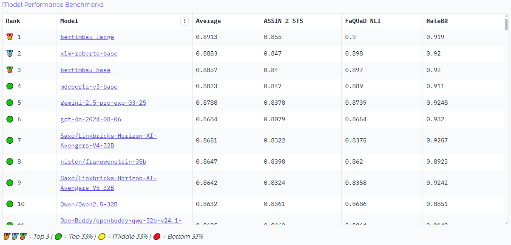
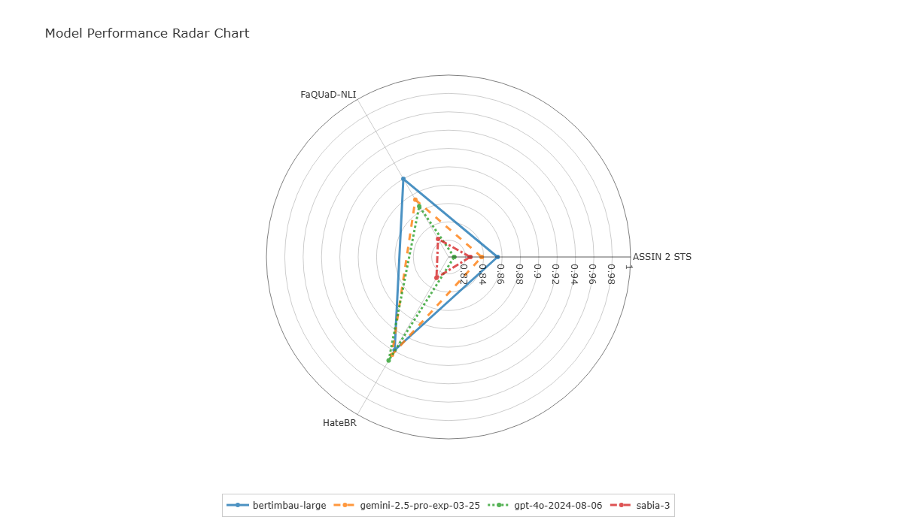

<h1 align="center">👋 Hi, I'm Ruan</h1>
<h3 align="center">Senior AI Engineer | Generative AI | RAG | LLMs | NLP | Python</h3>

<a href="https://ruanchaves.github.io/">🌐 Personal Website</a>

---

## 🚀 Projects

- **[ruanchaves/hashformers](https://github.com/ruanchaves/hashformers)**: State-of-the-art framework for hashtag segmentation.

- **[ruanchaves/napolab](https://github.com/ruanchaves/napolab)**: The Natural Portuguese Language Benchmark.
    - Browse the **[Napolab Leaderboard](https://huggingface.co/spaces/ruanchaves/napolab)** and stay up to date with the latest advancements in Portuguese language models.

  
  

---

## 🌟 Contributions

_Click on the links to view my pull requests._

- **[argilla-io/argilla](https://github.com/argilla-io/argilla/issues?q=author%3Aruanchaves+)**:
  - Fixed bugs and shipped features related to semi-supervised learning (SSL) during my internship at Argilla.
- **[huggingface/transformers](https://github.com/huggingface/transformers/pull/10823)**:
  - Modified the Trainer class for simultaneous Ray Tune and Weights & Biases execution.
- **[nathanshartmann/portuguese_word_embeddings](https://github.com/nathanshartmann/portuguese_word_embeddings/pull/11)**:
  - Fixed a severe bug in the evaluation procedure.
  - Documented the bug fix in the research paper ["Portuguese language models..."](https://scholar.google.com/citations?view_op=view_citation&hl=en&user=3JDK8KEAAAAJ&citation_for_view=3JDK8KEAAAAJ:u-x6o8ySG0sC).
- **[facebookresearch/BLINK](https://github.com/facebookresearch/BLINK/pull/25)**:
  - Fixed a parameter bug in the script for the BLINK benchmark.
- **[awslabs/mlm-scoring](https://github.com/awslabs/mlm-scoring/pull/12)**:
  - Addressed an installation instruction issue for the mlm-scoring library.

---

## 📖 Papers With Code

- **[neuralmind-ai/coliee](https://github.com/neuralmind-ai/coliee)**:
  - Code for ["To Tune or Not To Tune? Zero-shot Models for Legal Case Entailment"](https://arxiv.org/abs/2202.03120)
  - Code for ["Yes, BM25 is a Strong Baseline for Legal Case Retrieval"](https://arxiv.org/abs/2105.05686)
- **[ruanchaves/elmo](https://github.com/ruanchaves/elmo)**:
  - Code for ["Portuguese language models and word embeddings: evaluating on semantic similarity tasks"](https://scholar.google.com/citations?view_op=view_citation&hl=en&user=3JDK8KEAAAAJ&citation_for_view=3JDK8KEAAAAJ:u-x6o8ySG0sC).
- **[ruanchaves/assin](https://github.com/ruanchaves/assin)**:
  - Code for ["Multilingual Transformer Ensembles for Portuguese Natural Language Tasks"](https://scholar.google.com/citations?view_op=view_citation&hl=pt-PT&user=3JDK8KEAAAAJ&citation_for_view=3JDK8KEAAAAJ:qjMakFHDy7sC).
- **[ruanchaves/BERT-WS](https://github.com/ruanchaves/BERT-WS)**:
  - Code for ["Domain adaptation of transformers for english word segmentation"](https://scholar.google.com/citations?view_op=view_citation&hl=pt-PT&user=3JDK8KEAAAAJ&citation_for_view=3JDK8KEAAAAJ:9yKSN-GCB0IC).

---

📧 **Email**: ruanchaves93@gmail.com
