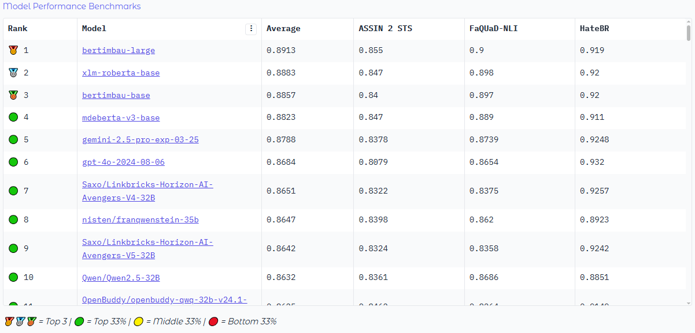
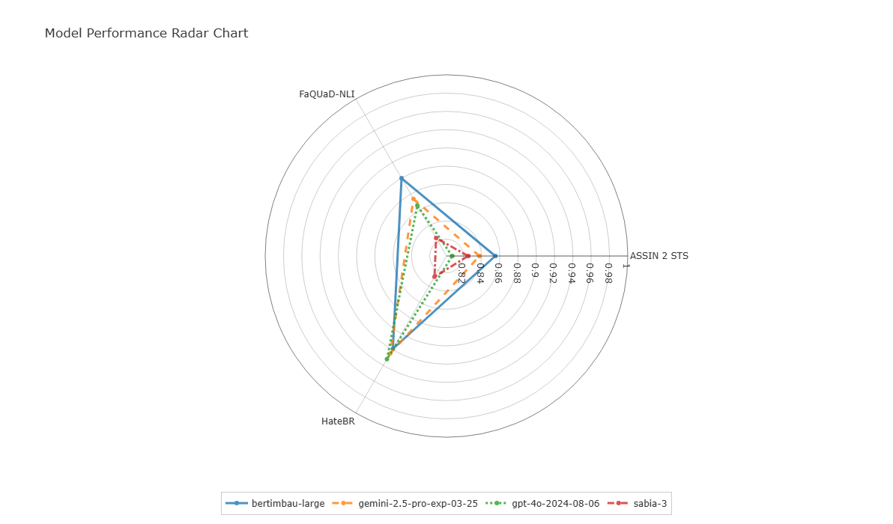

<h1 align="center">👋 Hi, I'm Ruan</h1>

<h3 align="center">
Senior AI Engineer | Generative AI | RAG | LLMs | NLP | Python
</h3>

I build AI systems for retrieval, evaluation, automation, and applied NLP.

<a href="https://ruanchaves.github.io/">🌐 Personal Website</a> ·
<a href="mailto:ruanchaves93@gmail.com">📧 Email</a>

---

## 🚀 Portfolio Projects

_Coming soon: selected production-style GenAI, RAG, evaluation, and automation projects._

---

## 📚 Research & Academic Projects

### 2023 — [Napolab](https://github.com/ruanchaves/napolab)

The Natural Portuguese Language Benchmark.

Portuguese language model evaluation benchmark and dataset collection. A key contribution of this work is **FaQuAD-NLI**, which has been widely reused by the Portuguese NLP community, including in Portuguese LLM evaluation tooling and leaderboards.

- [Napolab Leaderboard](https://huggingface.co/spaces/ruanchaves/napolab)
- [Medium article: The Hidden Truth About LLM Performance](https://ruanchaves.medium.com/the-hidden-truth-about-llm-performance-why-your-benchmark-results-might-be-misleading-afd24f40a46c)
- [Master’s thesis: Lessons learned from the evaluation of Portuguese language models](https://www.um.edu.mt/library/oar/handle/123456789/120557)

  
  

---

### 2021 — [hashformers](https://github.com/ruanchaves/hashformers)

State-of-the-art research code for multilingual hashtag and word segmentation.

Hashformers uses language models and beam search to segment hashtags and whitespace-free text. The project was recognized as state-of-the-art for hashtag segmentation at **LREC 2022** and has been cited and reused in multiple research papers.

- Paper: [Zero-shot hashtag segmentation for multilingual sentiment analysis](https://arxiv.org/pdf/2112.03213)

---

### 2022 — [neuralmind-ai/coliee](https://github.com/neuralmind-ai/coliee)

Code for legal NLP research:

- [To Tune or Not To Tune? Zero-shot Models for Legal Case Entailment](https://arxiv.org/abs/2202.03120)
- [Yes, BM25 is a Strong Baseline for Legal Case Retrieval](https://arxiv.org/abs/2105.05686)

---

### 2020 — [ruanchaves/BERT-WS](https://github.com/ruanchaves/BERT-WS)

Code for:

- [Domain adaptation of transformers for English word segmentation](https://scholar.google.com/citations?view_op=view_citation&hl=pt-PT&user=3JDK8KEAAAAJ&citation_for_view=3JDK8KEAAAAJ:9yKSN-GCB0IC)

---

### 2020 — [ruanchaves/assin](https://github.com/ruanchaves/assin)

Code for:

- [Multilingual Transformer Ensembles for Portuguese Natural Language Tasks](https://scholar.google.com/citations?view_op=view_citation&hl=pt-PT&user=3JDK8KEAAAAJ&citation_for_view=3JDK8KEAAAAJ:qjMakFHDy7sC)

---

### 2020 — [ruanchaves/elmo](https://github.com/ruanchaves/elmo)

Code for:

- [Portuguese language models and word embeddings: evaluating on semantic similarity tasks](https://scholar.google.com/citations?view_op=view_citation&hl=en&user=3JDK8KEAAAAJ&citation_for_view=3JDK8KEAAAAJ:u-x6o8ySG0sC)

---

## 🌟 Open Source Contributions

Selected contributions to machine learning and NLP libraries.

### 2022 — [argilla-io/argilla](https://github.com/argilla-io/argilla/issues?q=author%3Aruanchaves+)

Fixed bugs and shipped features related to semi-supervised learning during my internship at Argilla.

---

### 2021 — [huggingface/transformers](https://github.com/huggingface/transformers/pull/10823)

Modified the `Trainer` class to support simultaneous Ray Tune and Weights & Biases execution.

---

### 2021 — [awslabs/mlm-scoring](https://github.com/awslabs/mlm-scoring/pull/12)

Improved installation instructions for the `mlm-scoring` library.

---

### 2020 — [facebookresearch/BLINK](https://github.com/facebookresearch/BLINK/pull/25)

Fixed a parameter bug in a BLINK benchmark script.

---

### 2019 — [nathanshartmann/portuguese_word_embeddings](https://github.com/nathanshartmann/portuguese_word_embeddings/pull/11)

Fixed a severe bug in the evaluation procedure.

The fix was documented in the paper [“Portuguese language models and word embeddings: evaluating on semantic similarity tasks”](https://scholar.google.com/citations?view_op=view_citation&hl=en&user=3JDK8KEAAAAJ&citation_for_view=3JDK8KEAAAAJ:u-x6o8ySG0sC).

---

## 📫 Contact

- Website: [ruanchaves.github.io](https://ruanchaves.github.io/)
- Email: [ruanchaves93@gmail.com](mailto:ruanchaves93@gmail.com)
